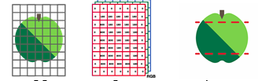
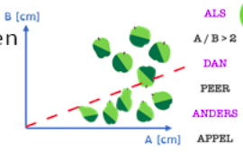

<context>
### Context

Kan een computer dier- en plantensoorten herkennen?

</context>
<decomposition>
Dit probleem kunnen we bijvoorbeeld opsplitsen in twee belangrijke subtaken (**decompositie**):
1. Representatie
2. Classificatie
</decomposition>
<patternRecognition>
Het herkennen van objecten komt voor in tal van contexten. Vaak worden dus gelijkaardige oplossingen toegepast (denk bijvoorbeeld aan de populariteit van AI (diepe neurale netwerken) voor beeldherkenning). (**patroonherkenning**)
</patternRecognition>
<abstraction>

Hoe stellen we planten en dieren voor aan de computer? (**abstractie**)
</abstraction>
<algorithms>
Op basis van die getallen kunnen we een **algoritme** opstellen waarmee een computer appels en peren kan onderscheiden.

</algorithms>
<implementation>
Implementatie is hier niet van toepassing, dit is een unplugged voorbeeld.
</implementation>

