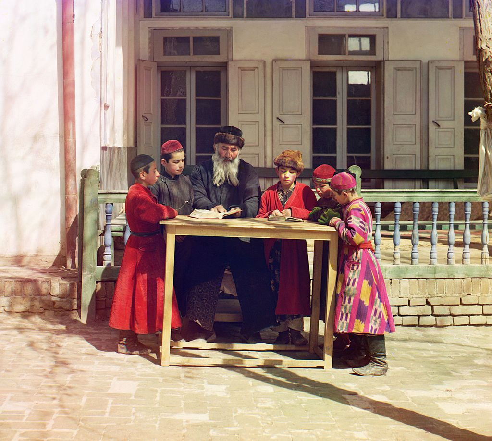
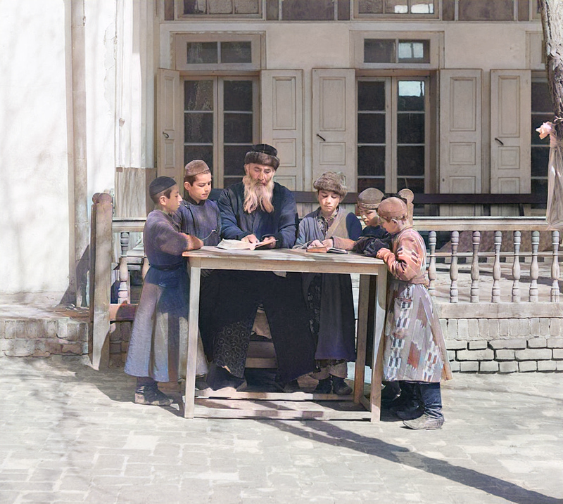
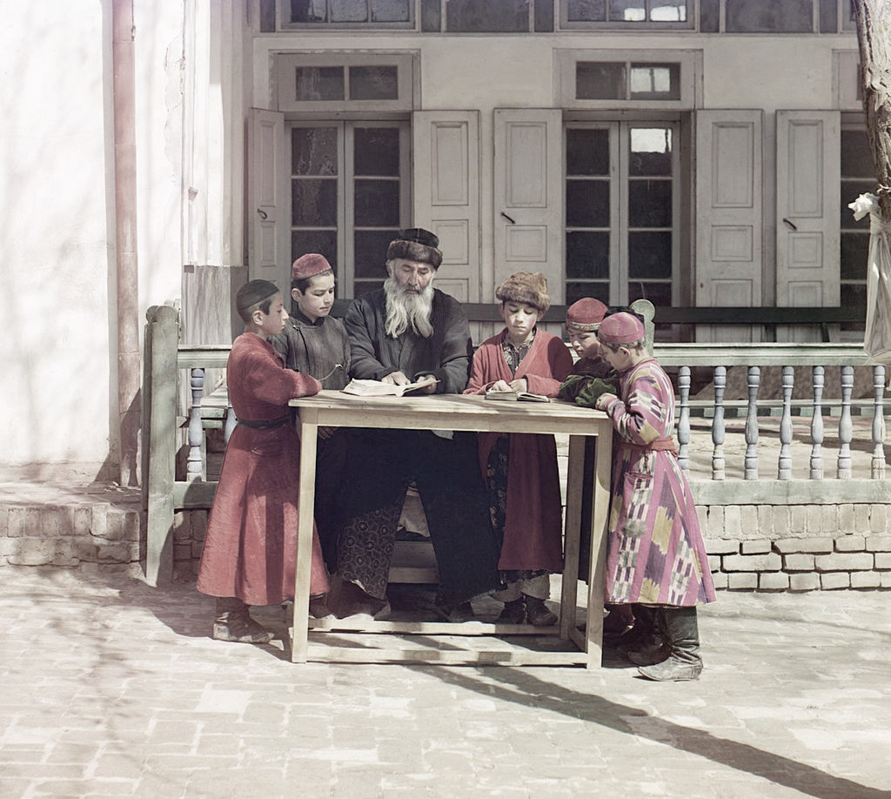

# Foto's inkleuren

Een specifieke toepassing van AI-systemen is het inkleuren van zwart-wit beelden. In de rest van deze les gaan we dieper in op hoe deze systemen in staat zijn om automatisch foto's in te kleuren.

Oefening
------------

 De volgende foto werd genomen door Sergei Mikhailovich Prokudin-Gorskii in het Russische rijk ergens tussen 1905 en 1915. Je ziet hieronder drie weergaven van dezelfde foto. Twee van de weergaven zijn bewerkt, een is het origineel. Welke foto is volgens jou het origineel?

 
 
 

 **Waarom heb je voor de ene of de andere foto gekozen?**

 **Heb je het origineel correct kunnen aanduiden?**

 **Uitleg**:
  Het gaat hier om 3 foto’s. De eerste foto is de originele afbeelding. De tweede foto werd gegenereerd door een AI-systeem dat geleerd heeft om zwart-wit foto's in te kleuren. Eerst werden dus de kleuren uit het origineel weggehaald en dan werd gevraagd aan het algoritme om de zwart-wit foto in te kleuren. De laatste afbeelding werd gegenereerd door in Photoshop de saturatie van de originele afbeelding te verminderen.
