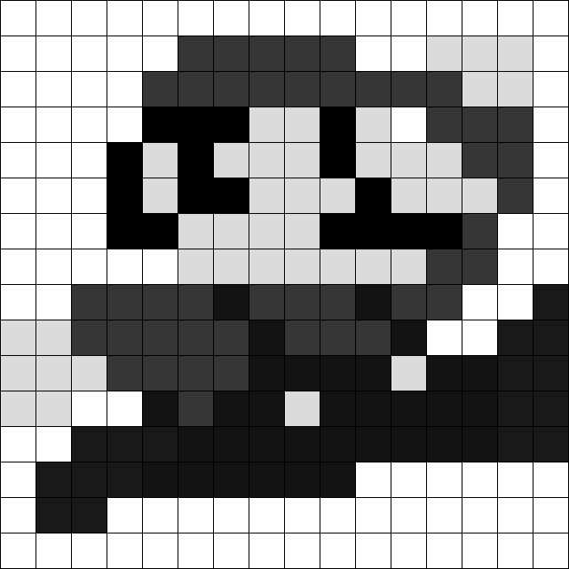

## Waar komen de kleuren vandaan (1)?

Zelf een grijswaardenafbeelding inkleuren
--------------------------------------------

Hieronder zie je een pixelart afbeelding. Je krijgt van de lesgever een raster dat even groot is als dat op de afbeelding. Prober het lege raster in te kleuren zodat je een gekleurde versie bekomt van onderstaande afbeelding.

