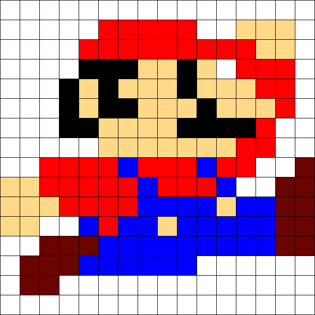

## Waar komen de kleuren vandaan (2)?

Hieronder zie je de originele versie van de afbeelding. Komt jouw inkleuring overeen met het origineel? **Hoe wist je welke kleur je moest gebruiken?**

TODO: Iemand zoeken die pixel art kan maken van jommeke?

