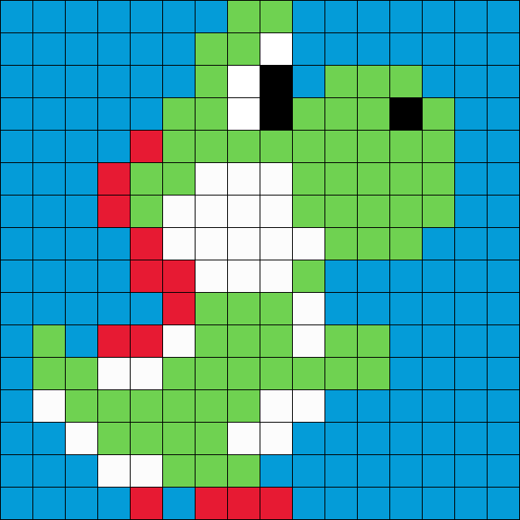
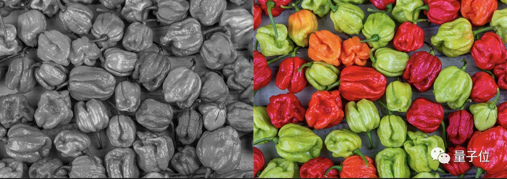

## Waar komen de kleuren vandaan (4)?

Hieronder zie je opnieuw de oplossing. **Waarom ging het deze keer beter of slechter dan bij de vorige afbeelding?**

Om te weten door welke kleuren je de grijswaarden moet vervangen heb je duidelijk al **voorkennis** nodig. Zonder deze voorkennis is het correct inkleuren van de afbeeldingen onmogelijk. AI-systemen leren op basis van heel veel voorbeeldafbeeldingen hoe bepaalde voorwerpen eruitzien. Zo kunnen ze bijvoorbeeld leren dat gras groen is, de lucht blauw en de zon geel. Als het dan een van die voorwerpen herkent in een zwart-wit afbeelding dan weet het in welke kleur het voorwerp ingekleurd moet worden. Voor sommige voorwerpen is deze voorkennis niet genoeg om de afbeelding correct te kunnen inkleuren. Dat kan je duidelijk zien op onderstaande afbeelding. TOTO: uitleg moet beter.

