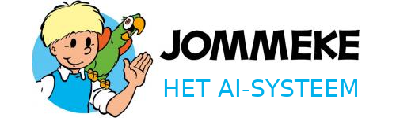
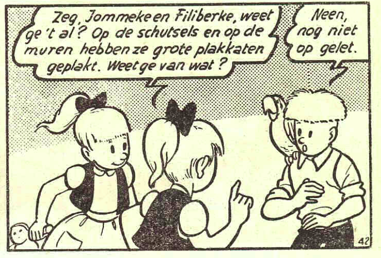
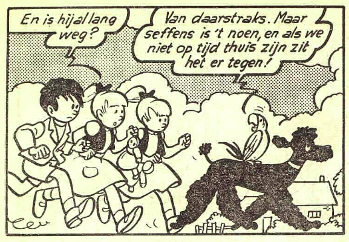
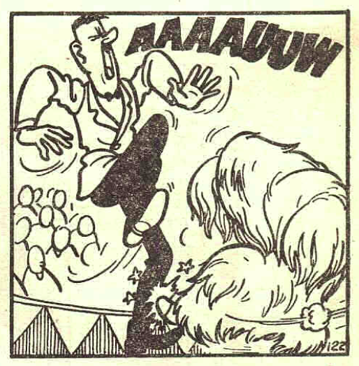
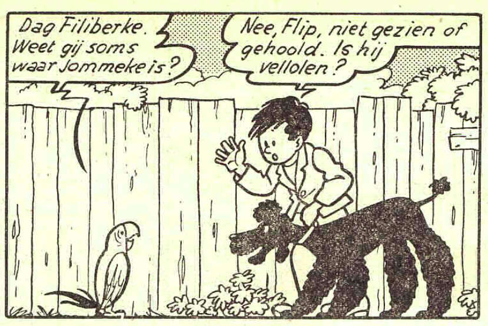
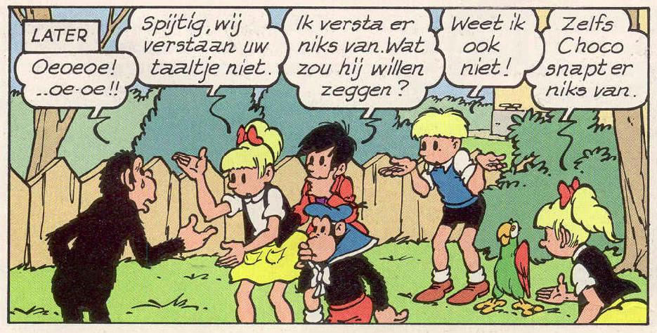
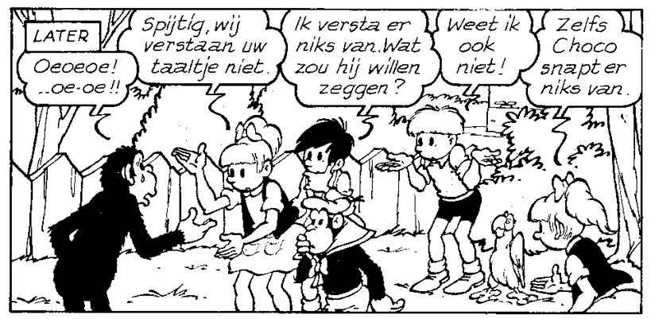
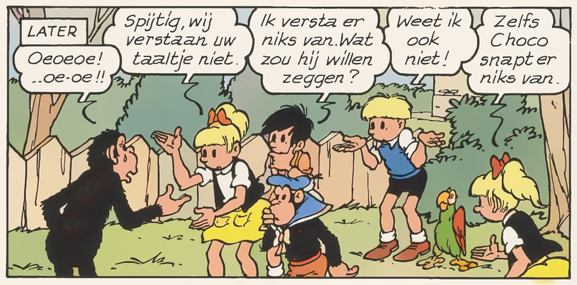

# Zelf aan de slag

Jommeke is een Belgische stripreeks die werd bedacht en oorspronkelijk getekend door Jef Nys. Nu kennen we Jommeke allemaal als de jongen met het blonde haar en de blauwe trui maar wist je dat de verhalen van Jommeke vroeger in het zwart-wit getekend werden? Hieronder zie je een aatal voorbeelden van hoe de strip er vroeger uitzag.

TODO: Link naar thesis, momenteel niet op biblio..

Aan de Universiteit Gent werd door Simon Schellaert een AI-systeem ontwikkeld dat het mogelijk maakt om oude Jommeke strips in te kleuren. Om het AI-systeem te leren hoe het zwart-wit afbeeldingen moet inkleuren heb je heel veel voorbeeldafbeeldingen nodig waarvan je zowel een zwart-wit als ingekleurde versie hebt. Omdat de meeste Jommekestrips in kleur zijn moeten die eerst omgezet worden naar zwart-wit. Hieronder zie je een voorbeeld van een afbeelding die naar zwart-wit werd omgezet.

In het bovenstaande voorbeeld is duidelijk dat het algoritme in staat is om het zwart-wit prentje in te kleuren. Maar hoe goed is het AI-syteem? Is het even goed als een mens die de kleurentekeningen maakt? Vertoont het syteem menselijke intelligente en zoja, hoe intelligent is het dan?