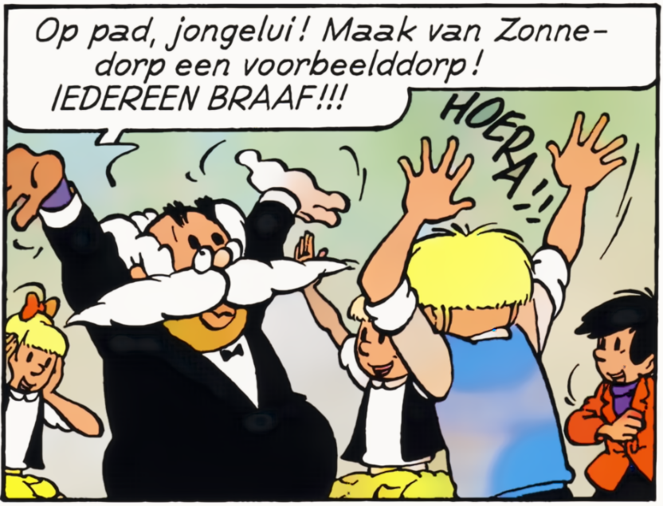

## Turingtest

Al in 1936 bedacht Alan Turing een test om te bepalen in hoeverre een computersysteem menselijke intelligentie vertoont. In de originele test moet een gebruiker chatten met een persoon die deze niet kent. De peroon aan de andere kant van de chat is ofwel een echte persoon ofwel een computerprogramma die een persoon probeert na te doen. Als de gebruiker met een computer aan het chatten is maar dit niet door heeft dan slaagt het computerprogramma voor de Turingtest.

We hebben voor ons AI-systeem ook een soort van Turingtest opgesteld. Kan jij in onderstaande vragen aanduiden welke van de afbeeldingen het origineel is?

| **Afbeelding** | **Origineel of gegenereerd?** |
|---------------------------|:---:|
|  | origineel/ gegenereerd |
|  | origineel/ gegenereerd |
|  | origineel/ gegenereerd |
|  | origineel/ gegenereerd |
| | origineel/ gegenereerd |
| | origineel/ gegenereerd |
|  | origineel/ gegenereerd |
|  | origineel/ gegenereerd |
|  | origineel/ gegenereerd |
|  | origineel/ gegenereerd |
|  | origineel/ gegenereerd |
|  | origineel/ gegenereerd |