## Turingtest

Hieronder zie je de oplossing van de vraag op de vorige pagina. Hoeveel afbeeldingen heb jij correct kunnen herkennen?

| **Afbeelding** | **Origineel of gegenereerd?** |
|---------------------------|:---:|
| 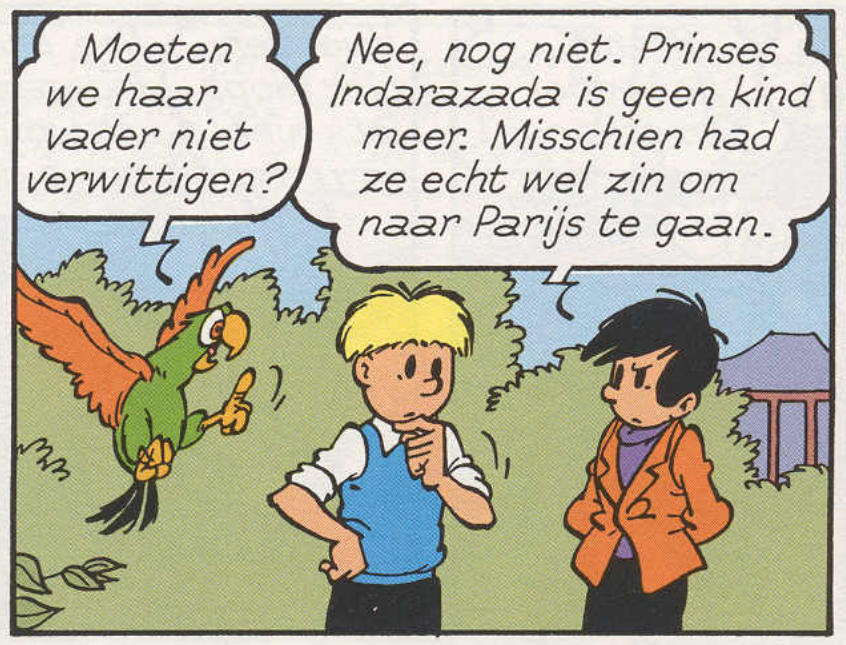 | origineel |
| 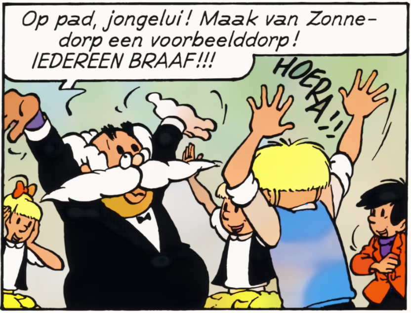 | gegenereerd |
| 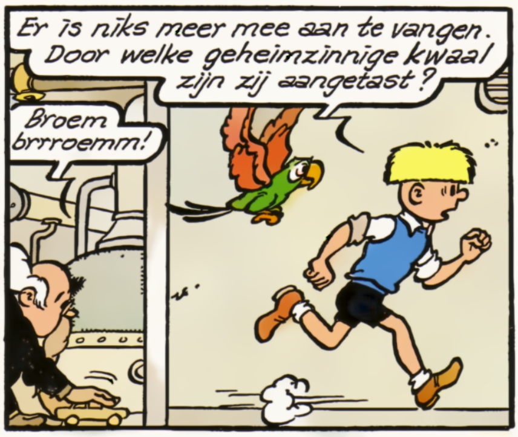 | gegenereerd |
|  | gegenereerd |
| 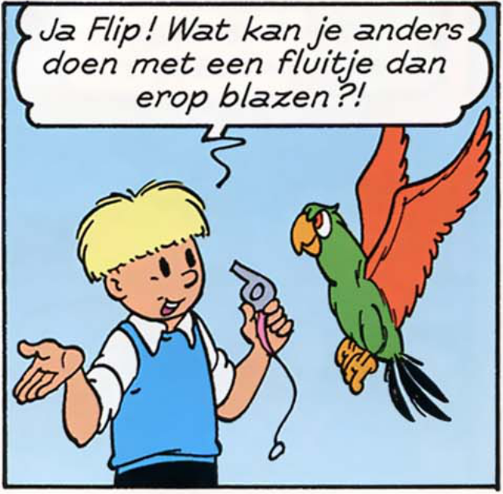| origineel |
| 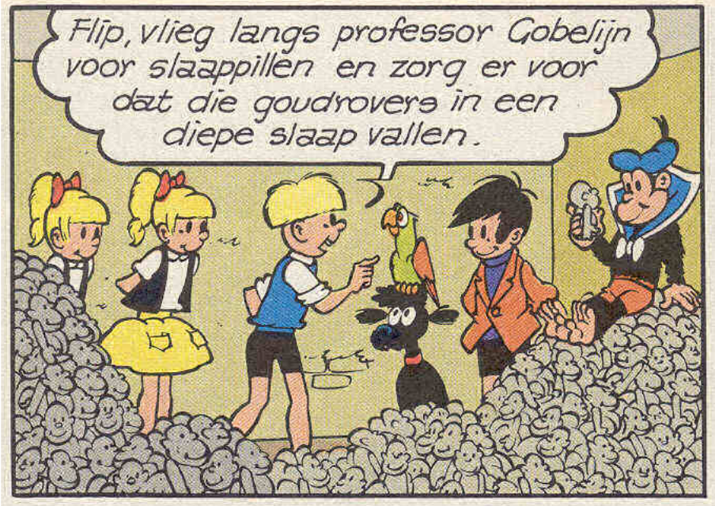| origineel |
| 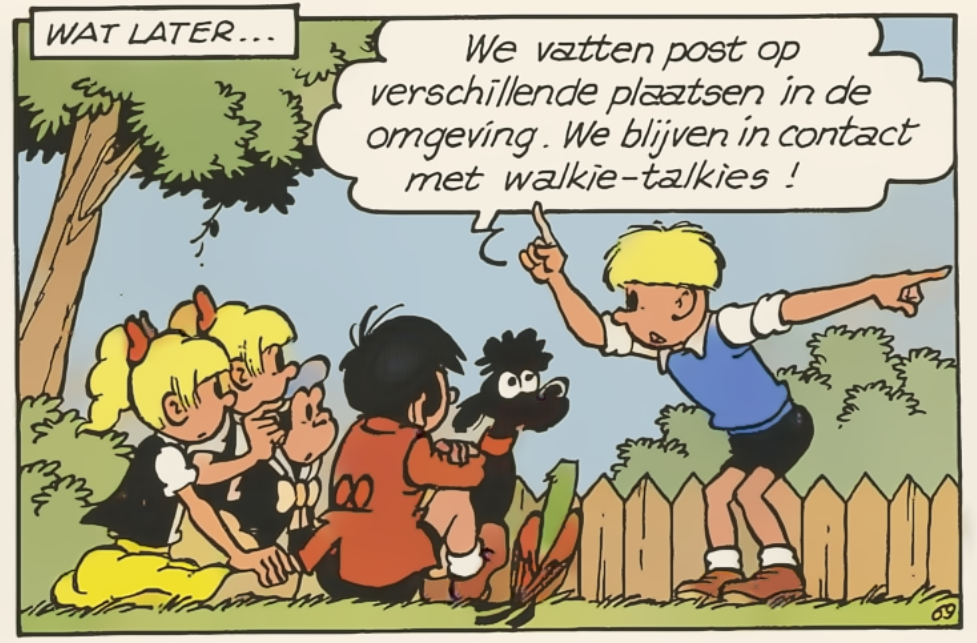 | gegenereerd |
| 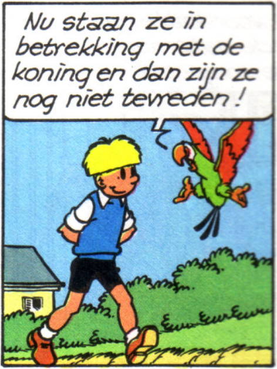 | origineel |
| 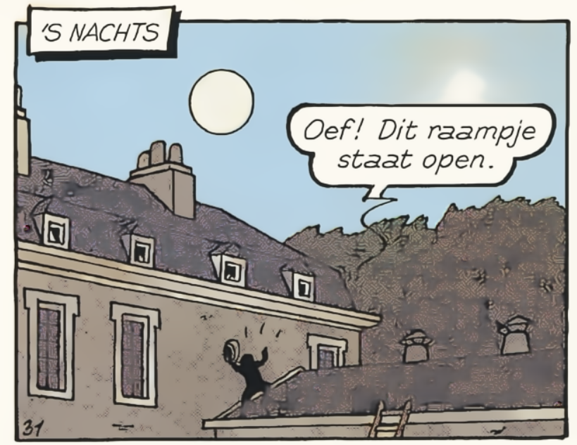 | gegenereerd |
| 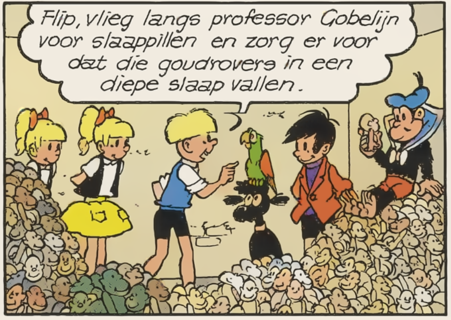 | gegenereerd |
| 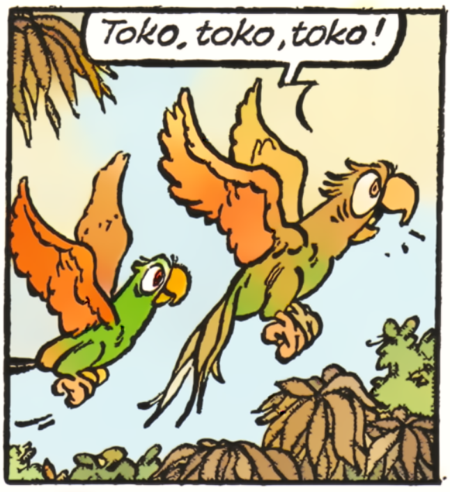 | gegenereerd |
| 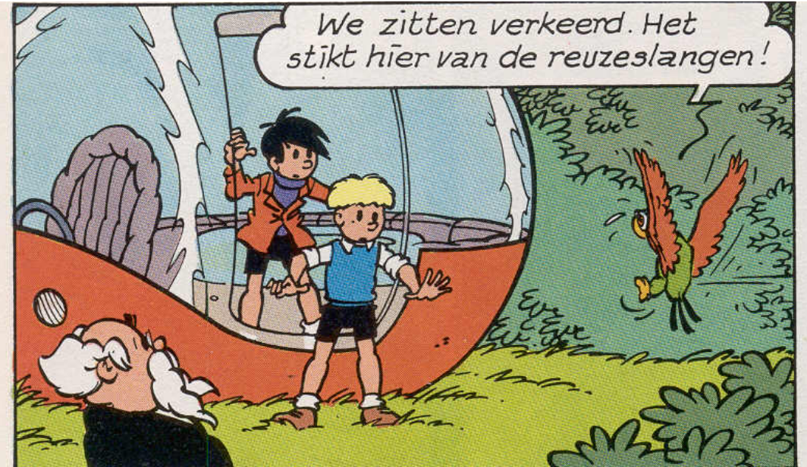 | origineel |

**Op welke manieren gaat het inkleuren allemaal fout?**
Bekijk de ingekleurde afbeeldingen nog eens goed. Op welke manier loopt het mis in die afbeeldingen?